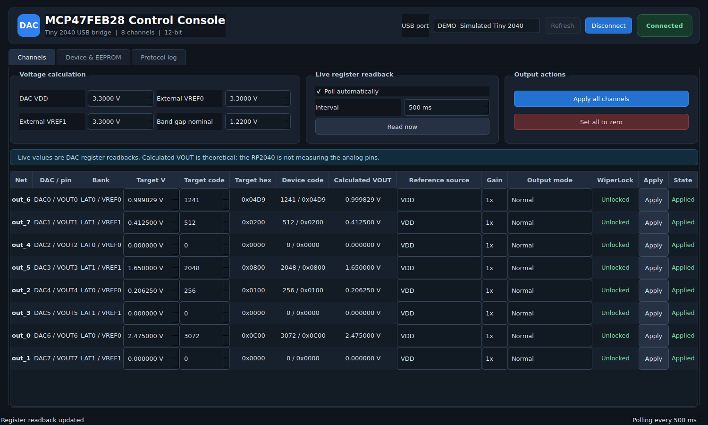

# Tiny 2040 MCP47FEB28 USB DAC Controller

This project turns the Pimoroni Tiny 2040 into a USB control interface for the
12-bit, eight-channel MCP47FEB28 DAC.

It contains two main programs:

- `firmware/main.py` runs on the Tiny 2040 under MicroPython.
- `desktop/dac_control_app.py` is the Python/PySide6 desktop application.

The desktop application periodically reads the DAC registers and provides
voltage/code editing, reference selection, gain, power-down controls,
WiperLock status, EEPROM power-on settings, a raw register inspector and a USB
protocol log.



## 1. Wiring

| Tiny 2040 | DAC board | Purpose |
|---|---|---|
| GP0, physical pin 16 | SDA | I2C data |
| GP1, physical pin 15 | SCL | I2C clock |
| GND, physical pin 2 or 8 | GND | Common reference |
| 3V3, physical pin 3 | DAC 3.3 V | Only when the Tiny 2040 powers the DAC |

Also ensure:

- A0 and A1 are grounded, selecting I2C address `0x60`.
- LAT0 and LAT1 are grounded, enabling immediate output updates.
- SDA and SCL have one set of pull-ups, such as the existing 4.7 kOhm
  resistors to 3.3 V.
- Do not connect two independent 3.3 V regulator outputs together. If the DAC
  has its own supply, connect only GND, SDA and SCL.

## 2. Install the firmware with Thonny

1. Load Pimoroni MicroPython onto the Tiny 2040 if it is not already installed.
2. Open `firmware/main.py` in Thonny.
3. Select **MicroPython (Raspberry Pi Pico)** and the Tiny 2040 COM port.
4. Save the file **to the MicroPython device** with the exact name `main.py`.
5. Press **Run -> Stop/Restart backend**, or power-cycle the board.

The firmware starts automatically and waits for USB JSON commands. It does not
change any DAC register at boot.

Important: disconnect Thonny from the COM port before starting the desktop
application. Only one program can own the serial port at a time. To recover the
interactive MicroPython prompt later, reconnect with Thonny and press **Stop**
or `Ctrl+C`.

## 3. Install and run the desktop application

On Windows, open PowerShell in this project folder:

```powershell
py -m venv .venv
.venv\Scripts\Activate.ps1
py -m pip install -r requirements.txt
py desktop\dac_control_app.py
```

If PowerShell blocks activation, the equivalent direct commands are:

```powershell
py -m venv .venv
.venv\Scripts\python.exe -m pip install -r requirements.txt
.venv\Scripts\python.exe desktop\dac_control_app.py
```

For a hardware-free demonstration:

```powershell
.venv\Scripts\python.exe desktop\dac_control_app.py --demo
```

## 4. Normal use

1. Disconnect Thonny.
2. Connect the Tiny 2040 through USB.
3. Launch the desktop application.
4. Select the Tiny 2040 COM port and click **Connect**.
5. Enter the actual voltage measured at the DAC VDD pin in **DAC VDD**.
6. Change a target voltage or code and click that row's **Apply** button.
7. Use **Apply all channels** to send all eight complete channel settings.

The schematic mapping is built in:

| DAC channel | Schematic net | LAT/VREF bank |
|---:|---|---|
| DAC0 | out_6 | LAT0 / VREF0 |
| DAC1 | out_7 | LAT1 / VREF1 |
| DAC2 | out_4 | LAT0 / VREF0 |
| DAC3 | out_5 | LAT1 / VREF1 |
| DAC4 | out_2 | LAT0 / VREF0 |
| DAC5 | out_3 | LAT1 / VREF1 |
| DAC6 | out_0 | LAT0 / VREF0 |
| DAC7 | out_1 | LAT1 / VREF1 |

## Register readback versus voltage measurement

The application reads the actual DAC code and configuration registers. The
displayed VOUT is calculated from those registers and the reference voltages
entered in the interface:

```text
ideal VOUT = reference_scale * code / 4096
```

It is not an electrical measurement of the VOUT pin. Measuring all eight
physical voltages would require ADC inputs plus an analog multiplexer or an
external multichannel ADC.

## Reference modes

Each channel exposes all four MCP47FEB28 reference selections:

- VDD
- Internal band gap
- External VREF, unbuffered
- External VREF, buffered

When internal band-gap mode is selected, the corresponding VREF pin becomes an
output and must not be driven by an external source. VDD reference mode uses 1x
gain; the application automatically corrects an attempted 2x selection.

## EEPROM controls

Normal edits affect volatile registers and disappear at the next DAC power
cycle. **Save current state to EEPROM** stores:

- all eight DAC codes;
- all eight VREF selections;
- all eight power-down modes;
- all eight gain bits.

The firmware preserves the existing I2C address and address-lock bits. It
compares every EEPROM register first and skips unchanged values. A confirmation
dialog in the application and a separate firmware confirmation token protect
against accidental writes.

**Load EEPROM into outputs** copies the saved power-on settings into volatile
registers without power-cycling.

WiperLock state is displayed but cannot be changed by this board because
changing it requires the special high-voltage HVC procedure on LAT0/HVC.

## USB protocol

The transport is newline-delimited JSON. Each host request contains a unique
`id` and the firmware returns the same `id`:

```json
{"id":1,"cmd":"get_state"}
```

```json
{"id":1,"ok":true,"result":{"channels":[]}}
```

Implemented commands are:

- `hello` / `get_info`
- `scan`
- `get_state`
- `get_eeprom`
- `set_channel`
- `apply_state`
- `zero_all`
- `save_eeprom`
- `load_eeprom`
- `raw_read`
- `raw_write` for volatile addresses `0x00` through `0x0A`

## Troubleshooting

- **Port is busy:** close or disconnect Thonny and any serial terminal.
- **No Tiny 2040 port:** use a USB data cable, not a charge-only cable.
- **Tiny 2040 connects but DAC is missing:** check common ground, 3.3 V power,
  GP0/GP1 orientation, pull-ups and A0/A1.
- **Writes read back but outputs do not change:** measure LAT0 and LAT1 directly
  at the DAC; both should be near 0 V in this hardware configuration.
- **Calculated voltage differs from a multimeter:** enter the measured DAC VDD
  or external-reference voltage, then account for DAC gain/offset error and
  loading.

## Technical references

- [Microchip MCP47FXBX4/8 datasheet](https://ww1.microchip.com/downloads/aemDocuments/documents/MSLD/ProductDocuments/DataSheets/MCP47FXBX48-Data-Sheet-DS200006368A.pdf)
- [MicroPython `machine.I2C` documentation](https://docs.micropython.org/en/latest/library/machine.I2C.html)
- [Pimoroni Tiny 2040 product documentation](https://shop.pimoroni.com/products/tiny-2040)

## Safety behavior

- No DAC writes occur merely because USB is connected.
- EEPROM is never written by polling or ordinary channel edits.
- Raw writes cannot target EEPROM or WiperLock registers.
- Changing the EEPROM I2C address is intentionally unsupported.
- The output-zero command is volatile and does not alter power-on settings.
